# Neural Forge

**AI Learning Simulator · Research-Grade Educational Platform · Neural Shield**

[](https://python.org)
[](https://fastapi.tiangolo.com)
[](https://react.dev)
[](https://typescriptlang.org)
[](https://vitejs.dev)
[](https://tailwindcss.com)
[](https://sqlite.org)
[](LICENSE)

---

<div align="center">

| | | |
| :---: | :---: | :---: |
| [🎮 Experience](#experience) | [🏗 Architecture](#architecture) | [🎓 Learning Design](#learning-design) |
| [📊 Analytics](#analytics--export) | [🔌 API](#api-reference) | [🚀 Getting Started](#getting-started) |
| [📁 Structure](#project-structure) | [🔬 Research](#research--evaluation) | [🗺 Roadmap](#roadmap) |

</div>

---

## Hero

<div align="center">

### Neural Shield — The AI Training Simulator That Teaches By Doing

*An interactive, research-grade simulation where learners diagnose and fix real ML problems — from dirty data to adversarial attacks — under realistic time and energy constraints. Every decision is logged, every outcome is measurable, and every session exports as publication-ready data.*

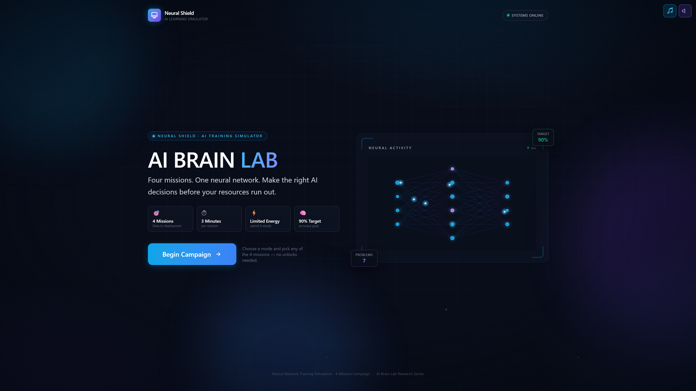

*Landing screen — mission selection, progression tracking, and mode choice (Solo / Team)*

</div>

---

## What Is Neural Forge?

Neural Forge is a **single-page React + FastAPI application** that simulates the end-to-end lifecycle of an AI system under pressure. It presents learners with **22 distinct ML problems** across **4 progressive missions**, each with **17 solution cards** that carry real energy costs, time costs, risk profiles, and educational annotations.

| Dimension | Detail |
|-----------|--------|
| **Primary audience** | ML engineers, data scientists, AI safety researchers, educators, students |
| **Core purpose** | Build intuition for ML reliability trade-offs through hands-on simulation |
| **Differentiators** | • Research-grade logging (every click, every millisecond)<br>• Authentic energy/economy mechanics (not gamified points)<br>• Team mode with 4 specialized roles<br>• Password-protected XLSX export for IRB studies<br>• Zero lock-in: all levels unlocked, independently playable |
| **Session length** | 3 minutes (180 s) per mission |
| **Win condition** | Reach ≥ 90 % accuracy before time or energy runs out |

---

## Experience

<div align="center">

### The Player Journey

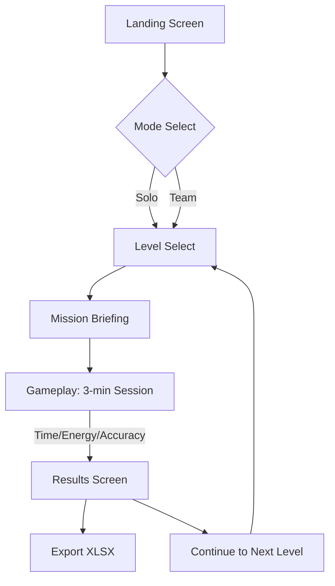

</div>

### Screenshots Gallery

<div align="center">

| | | |
| :---: | :---: | :---: |
|  | 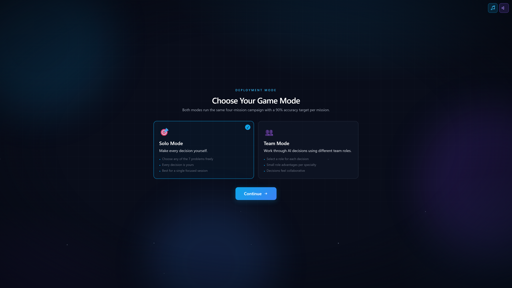 | 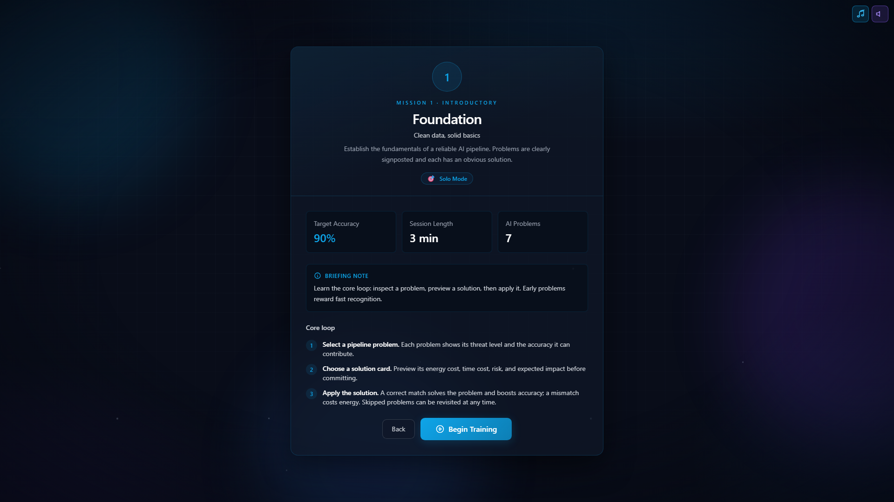 |
| **Landing** — Mission entry, mode choice, progression overview | **Mode Select** — Solo vs. Team with role preview | **Level Select** — 4 unlocked missions, solo/team badges |

| | | |
| :---: | :---: | :---: |
| 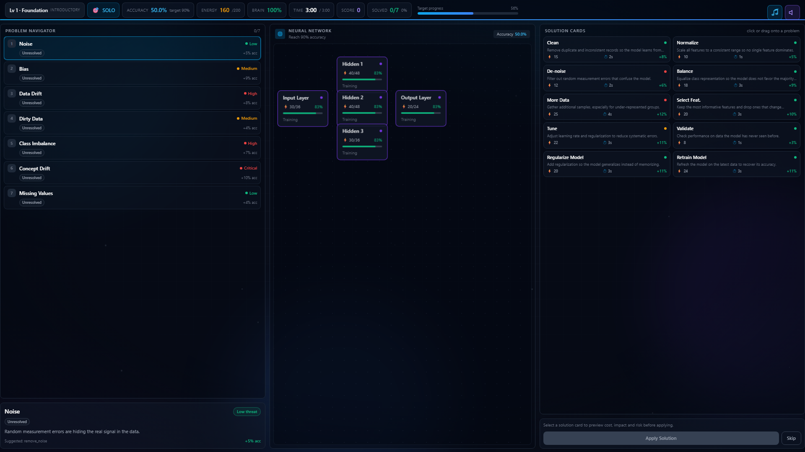 | 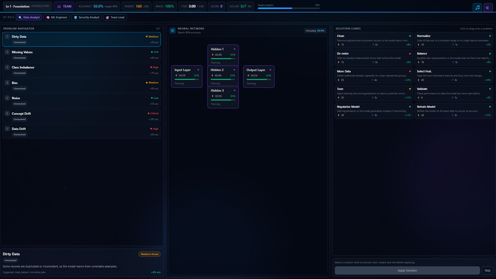 | 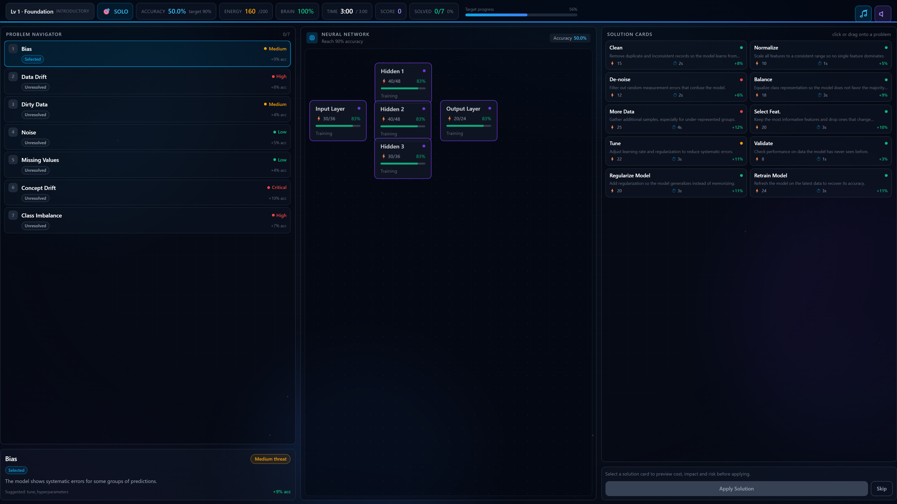 |
| **Mission Briefing** — Context, objectives, solo/team guides | **Gameplay Solo** — 3-column layout: Problems · Neural Network · Solutions | **HUD** — Accuracy, Energy, Brain Health, Time, Score |

| | | |
| :---: | :---: | :---: |
| 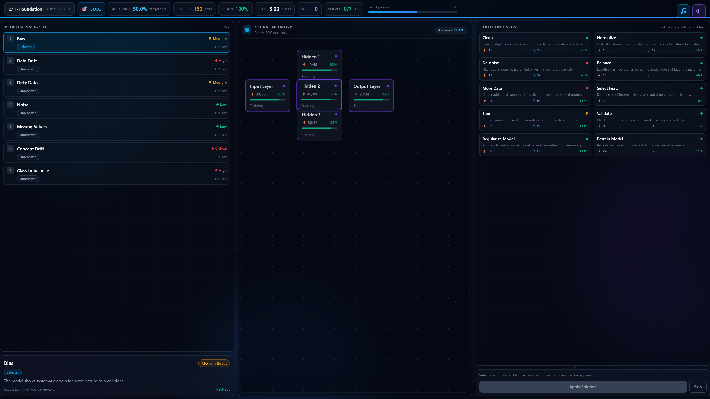 | 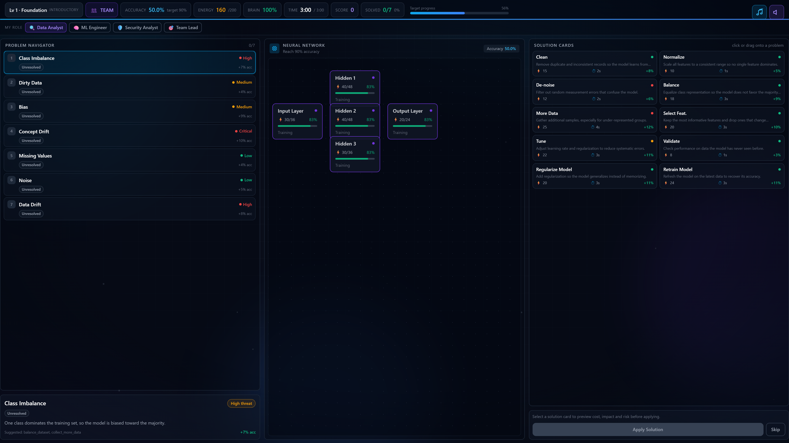 | 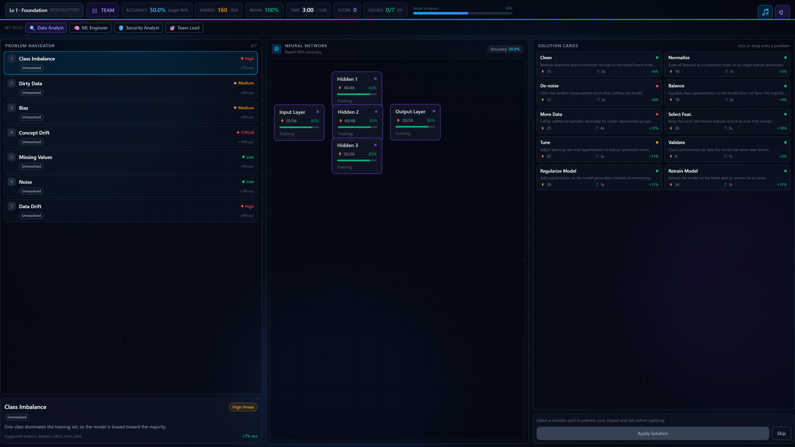 |
| **Problem Navigator** — 7 pipeline problems, threat levels, states | **Solution Cards** — 17 cards, energy/time cost, expected impact | **Neural Network** — React Flow DAG, live node energy, connections |

| | | |
| :---: | :---: | :---: |
|  |  | 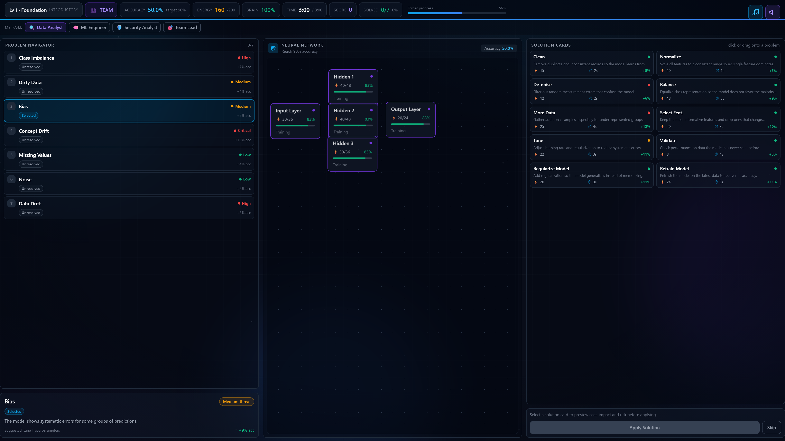 |
| **Problem Details** — Threat level, description, recommended solutions | **Action Preview** — Energy cost, expected impact, risk, educational note | **Neural Network Close-up** — Node energy %, importance, health |

</div>

---

## Core Capabilities

### 🎓 Learning by Doing
- **22 problems** spanning data quality, training dynamics, deployment risks, adversarial threats
- **17 solution cards** with authentic energy/time costs and risk trade-offs
- **Focus tags** (Speed / Analysis / Balance) teach decision patterns, not just answers
- **Educational insights** tie every solution to industry practice (e.g., "Data scientists spend 60–80 % of time cleaning data")

### ⚙️ Simulation Fidelity
- **Authoritative accuracy engine** — single source of truth for all metric changes
- **Energy economy** — 5-node neural network (Input, Hidden×3, Output) with 160 total energy
- **Time pressure** — 180 s countdown, 1 s server ticks, no pause
- **Deterministic replay** — session seed ensures reproducibility

### 🧠 Strategic Depth
- **Overlapping valid solutions** — many problems accept multiple cards; preview before commit
- **Energy/impact trade-offs** — strong cards cost more; manage reserves across 7 problems
- **Combo system** — consecutive correct solves multiply score
- **Role bonuses** (Team mode only) — ≤ 5 % reward/penalty multipliers per specialty

### 👥 Teamwork
- **4 roles**: Data Analyst, ML Engineer, Security Analyst, Team Lead
- **Role-tagged decisions** — every action attributed for post-session analysis
- **Consensus confirmation** — pending decision modal requires explicit team confirm
- **Independent progression** — solo and team tracks stored separately

### 📈 Analytics & Export
- **Per-interaction logging** — 30+ fields per row (timing, state before/after, role, outcome)
- **Session-level aggregates** — accuracy, brain health, energy, score, success rate
- **5-sheet XLSX** (password: `2026`): Research Summary, Challenge Summary, Action Log, Event Log, Research Metrics
- **Progression tracking** — per-participant, per-mode, per-level best accuracy & status

---

## Architecture

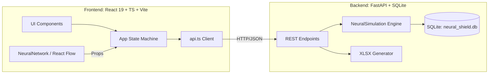

### Technology Stack (Verified)

| Layer | Technology | Version | Purpose |
|-------|------------|---------|---------|
| **Runtime (BE)** | Python | 3.13 | Backend execution |
| **Framework (BE)** | FastAPI | 0.115 | REST API, OpenAPI docs |
| **Server (BE)** | Uvicorn | 0.32 | ASGI server |
| **Database** | SQLite | 3 | Embedded, file-based, zero-config |
| **Data/Export** | pandas, xlsxwriter | 2.3, 3.2 | Analytics, password-protected Excel |
| **Runtime (FE)** | Node | 22.18 | Build & dev server |
| **Framework (FE)** | React | 19.2 | UI, hooks, concurrent features |
| **Language (FE)** | TypeScript | 6.0 | Type safety across API boundary |
| **Bundler** | Vite | 8.2 | Dev server, production build |
| **Styling** | Tailwind CSS | 4.3 | Utility-first, dark-theme design system |
| **Visualization** | React Flow | 11.11 | Neural network DAG rendering |
| **Linting** | Oxlint | 1.75 | Fast, Rust-based linter |

---

## Game Structure

### 4 Missions (Levels) — All Unlocked

| Level | Title | Subtitle | Difficulty | Problem Set (7 each) |
|-------|-------|----------|------------|----------------------|
| 1 | **Foundation** | Clean data, solid basics | Introductory | Dirty Data, Missing Values, Noise, Class Imbalance, Data Drift, Bias, Concept Drift |
| 2 | **Model Tuning** | Train smarter, not harder | Moderate | Overfitting, Underfitting, Feature Overload, Bias, Noise, Class Imbalance, Concept Drift |
| 3 | **Advanced AI** | Reliable under pressure | Advanced | Adversarial Noise, Edge Cases, Silent Data Corruption, Data Drift, Model Drift in Production, Overfitting, Feature Overload |
| 4 | **High-Risk AI** | Decisions under stakes | Expert | Deployment Risk, Feedback Loop, Model Drift in Production, Adversarial Noise, Silent Data Corruption, Concept Drift, Edge Cases |

> **Design note:** Difficulty rises through *decision complexity* (overlapping valid solutions, energy/impact trade-offs), not through harsher penalties or faster drain. Every mission requires ~6–7 correct solves to reach 90 %.

### 22 Problems — Metadata Rich

Each problem carries:
- **Threat level** 1–5 (Low → Critical)
- **Focus** → Speed / Analysis / Balance
- **Scenario** → Data quality, Noise, Class balance, Drift, Bias, Training, Adversarial, Reliability, Deployment
- **Recommended solutions** (1–2 per problem)
- **Description** — plain-language explanation for learners

### 17 Solution Cards — Verified Specs

| Card | Energy | Time (s) | Base Impact | Valid Targets |
|------|--------|----------|-------------|---------------|
| clean_dataset | 15 | 2 | 0.08 | Dirty Data, Silent Data Corruption |
| normalize_data | 10 | 1 | 0.05 | Dirty Data, Missing Values |
| remove_noise | 12 | 2 | 0.06 | Noise |
| balance_dataset | 18 | 3 | 0.09 | Class Imbalance, Feedback Loop |
| collect_more_data | 25 | 4 | 0.12 | Class Imbalance, Data Drift, Edge Cases |
| feature_selection | 20 | 3 | 0.10 | Data Drift, Concept Drift, Feature Overload |
| tune_hyperparameters | 22 | 3 | 0.11 | Bias, Overfitting, Underfitting |
| validate_model | 8 | 1 | 0.03 | Concept Drift, Edge Cases, Deployment Risk, Adversarial Noise |
| regularize_model | 20 | 3 | 0.11 | Overfitting, Bias |
| enhance_features | 18 | 2 | 0.09 | Underfitting |
| harden_model | 28 | 4 | 0.13 | Adversarial Noise, Edge Cases |
| stress_test_model | 15 | 2 | 0.08 | Edge Cases, Deployment Risk |
| monitor_model | 10 | 1 | 0.05 | Model Drift in Production, Feedback Loop |
| retrain_model | 24 | 3 | 0.11 | Model Drift in Production, Feedback Loop, Data Drift |
| staged_rollout | 16 | 2 | 0.07 | Deployment Risk |
| data_audit | 12 | 1 | 0.06 | Silent Data Corruption |

> Energy costs match `action_effects` in `simulation.py` exactly. Time cost is informational (displayed in preview).

### 4 Team Roles — Small, Deterministic Bonuses

| Role | Reward Multiplier | Penalty Multiplier | Specialty |
|------|-------------------|-------------------|-----------|
| Data Analyst | 1.05 | 1.00 | Data-quality problems |
| ML Engineer | 1.05 | 1.00 | Training/tuning problems |
| Security Analyst | 1.00 | 0.95 | Adversarial/deployment problems |
| Team Lead | 1.03 | 1.00 | General coordination |

> Bonuses apply **only** when a role is explicitly active (Team mode). Solo mode never sets a role → identical maths every run.

---

## Solo vs. Team Mode

| Aspect | Solo | Team |
|--------|------|------|
| **Players** | 1 | 2–4 |
| **Roles** | None (hidden) | 4 selectable, switchable |
| **Decision flow** | Instant apply | Select → Preview → Confirm (consensus) |
| **Attribution** | N/A | Every action tagged with role |
| **Progression** | Separate track | Separate track |
| **Bonuses** | None | Role multipliers (≤ 5 %) |
| **UI additions** | — | TeamBar, pending-decision modal |

Both modes share identical simulation engine, problem sets, and win conditions.

---

## Learning Design

### Pedagogical Principles

1. **Authentic constraints** — Energy and time are scarce; learners prioritize.
2. **Decision-first** — Preview shows cost/benefit/risk before commit.
3. **Immediate feedback** — "Good Decision" / "Try Another Approach" + accuracy delta.
4. **Reflection prompts** — Educational insight popups after correct solves (toggleable).
5. **Progress without gates** — All levels always unlocked; completion = informational badge.

### Educational Content Matrix

Every solution card includes:
- **Risk statement** — what can go wrong if misapplied
- **Educational note** — one-sentence real-world justification
- **Valid targets** — explicit problem-card mapping (no hidden rules)

Example: *Clean Dataset* → "Real teams spend most of their time cleaning data; consistent input is the foundation of reliable predictions."

---

## Analytics & Export

### Database Schema (SQLite)

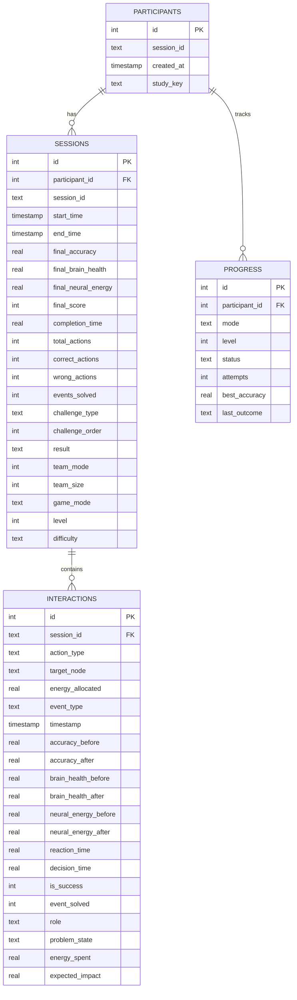

### XLSX Export (5 Sheets)

| Sheet | Purpose | Key Columns |
|-------|---------|-------------|
| **Research Summary** | One-row session overview | Participant, timestamps, accuracy, brain health, energy, score, actions, success rate, events solved, outcome |
| **Challenge Summary** | Mission-level comparison | Challenge, difficulty, order, duration, starting/final accuracy, health, energy, score, actions, result |
| **Action Log** | Every interaction row | Timestamp, action, problem, result, accuracy Δ, health Δ, energy spent, expected impact, role, reaction/decision time |
| **Event Log** | Problem-level outcomes | Timestamp, event, problem type, player response, correct/incorrect, time to response, accuracy before/after, role |
| **Research Metrics** | Aggregate statistics | Mean/min/max for accuracy, brain health, energy, level |

> File is **password-protected** (`2026`) and includes document properties (title, author, category, comments).

---

## API Reference

Base URL: `http://localhost:8080`

### Session Management

| Method | Endpoint | Description |
|--------|----------|-------------|
| `POST` | `/start-session` | Create session, initialize simulation, return initial state |
| `POST` | `/finish-session` | Compute final metrics, record progression, return summary |
| `GET` | `/results?session_id=` | Full session data + all interactions |
| `GET` | `/export/session-xlsx?session_id=` | Download password-protected XLSX |
| `GET` | `/progress?participant_id=&mode=` | Progression rows for participant/mode |

### Gameplay Actions

| Method | Endpoint | Body | Description |
|--------|----------|------|-------------|
| `POST` | `/apply-game-action` | `{session_id, action_type, target_event?}` | Legacy single-step solve |
| `POST` | `/apply-solution` | `{session_id, action_type, target_event, role?, decision_time?, reaction_time?}` | Full solution commit with timing |
| `POST` | `/select-problem` | `{session_id, problem_id, role?}` | Set active problem (SELECTED state) |
| `POST` | `/skip-problem` | `{session_id, problem_id, role?}` | Mark problem SKIPPED |
| `POST` | `/revisit-problem` | `{session_id, problem_id, role?}` | Reopen SKIPPED/IN_PROGRESS problem |
| `POST` | `/set-role` | `{session_id, role}` | Switch active team role |
| `POST` | `/preview-action` | `{session_id, action_type, target_event}` | Cost/benefit/risk without commit |
| `POST` | `/advance-time` | `{session_id, action_type: "1"}` | Advance game clock by N seconds |

### State Payload (Returned by Every Endpoint)

```json
{
  "accuracy": 0.544,
  "loss": 1.0,
  "precision": 0.5,
  "recall": 0.5,
  "brain_health": 100.0,
  "neural_energy": 155,
  "current_event": "Concept Drift",
  "active_events": ["Missing Values", "Concept Drift", ...],
  "problem_states": {"Missing Values": "SOLVED", "Concept Drift": "UNRESOLVED", ...},
  "problems": [...],           // 7 problem objects with metadata
  "solutions": [...],          // relevant solution cards for current mission
  "nodes": {...},              // 5-node network with energy/health %
  "events_solved": 1,
  "total_events": 7,
  "current_level": 2,
  "time_remaining": 180,
  "score": 15,
  "combo": 1,
  "game_status": "playing",
  "last_result": "correct",
  "last_message": "Good Decision",
  "last_problem": "Missing Values",
  "last_action": "normalize_data",
  "team_mode": false,
  "game_mode": "solo",
  "active_role": null,
  "mission_level": 1,
  "mission_title": "Foundation",
  "mission_subtitle": "Clean data, solid basics",
  "difficulty": "Introductory"
}
```

---

## Project Structure

```
Neural-Forge/
├── backend/
│   ├── main.py              # FastAPI app, 14 endpoints, XLSX export
│   ├── simulation.py        # NeuralSimulation engine, 22 problems, 17 solutions, 4 levels
│   ├── models.py            # SQLite models, auto-migration, validation
│   ├── requirements.txt     # fastapi, uvicorn, pandas, xlsxwriter
│   ├── neural_shield.db     # SQLite database (created at runtime)
│   └── *.py                 # Test suite (8 test modules)
├── frontend/
│   ├── src/
│   │   ├── components/      # 18 React components (GameplayScreen, NeuralNetwork, etc.)
│   │   ├── pages/           # LandingScreen, LevelSelectScreen, ResultsScreen
│   │   ├── services/api.ts  # Typed REST client
│   │   ├── config/missions.ts # 4 mission configs (mirrors backend)
│   │   ├── types/           # TypeScript interfaces
│   │   ├── lib/preview.ts   # Client-side preview computation
│   │   └── utils/           # Helpers
│   ├── package.json         # React 19, Vite 8, Tailwind 4, React Flow 11
│   ├── tsconfig*.json       # TypeScript config
│   └── vite.config.ts       # Vite config
├── github/workflows/
│   └── deploy.yml           # GitHub Pages deploy (frontend only)
├── images/                  # Screenshot folder (user-populated)
└── README.md                # This file
```

---

## Getting Started

### Prerequisites (Verified)

| Tool | Version | Install |
|------|---------|---------|
| Python | 3.13+ | [python.org](https://python.org/downloads) |
| Node.js | 22+ | [nodejs.org](https://nodejs.org) |
| npm | 10+ | bundled with Node |

### Backend

```bash
cd backend
pip install -r requirements.txt
python -m uvicorn main:app --host 0.0.0.0 --port 8080
# Server runs at http://localhost:8080
# OpenAPI docs at http://localhost:8080/docs
```

### Frontend (Development)

```bash
cd frontend
npm ci
npm run dev
# Vite dev server at http://localhost:5173
# Proxies API calls to http://localhost:8080 (configure in vite.config.ts if needed)
```

### Frontend (Production Build)

```bash
cd frontend
npm run build
# Output in frontend/dist/ — deploy to any static host
```

### Verify Connectivity

```bash
# Backend health
curl http://localhost:8080/docs

# Frontend build
ls frontend/dist/index.html frontend/dist/assets/*.js frontend/dist/assets/*.css
```

---

## Configuration

### Environment Variables

| Variable | Default | Description |
|----------|---------|-------------|
| `DATABASE_PATH` | `neural_shield.db` | SQLite file location (backend) |
| `API_BASE` | `http://localhost:8080` | Frontend API target (set in `frontend/src/services/api.ts`) |
| `CORS_ORIGINS` | `*` | Allowed origins (backend `main.py`) |

> No `.env` file is committed. Create locally if needed.

### Database

- **Auto-migration**: `models.py` adds missing columns on startup (`_ensure_*_columns`)
- **Password**: XLSX export uses static password `2026` (see `main.py:764`)
- **Location**: `backend/neural_shield.db` (created on first run)

---

## Deployment

### Frontend → GitHub Pages (Configured)

```yaml
# github/workflows/deploy.yml triggers on push to main
# Builds frontend, uploads dist/ as Pages artifact
# Requires: Settings → Pages → Source: GitHub Actions
```

### Backend → Any ASGI Host

```bash
# Example: Railway, Render, Fly.io, VPS
uvicorn main:app --host 0.0.0.0 --port $PORT
# Set API_BASE in frontend to deployed backend URL before build
```

### Docker (Not Provided — Add if Needed)

```dockerfile
# Backend
FROM python:3.13-slim
WORKDIR /app
COPY backend/requirements.txt .
RUN pip install -r requirements.txt
COPY backend/ .
CMD ["uvicorn", "main:app", "--host", "0.0.0.0", "--port", "8080"]

# Frontend (multi-stage)
FROM node:22-alpine AS build
WORKDIR /app
COPY frontend/package*.json .
RUN npm ci
COPY frontend/ .
RUN npm run build

FROM nginx:alpine
COPY --from=build /app/frontend/dist /usr/share/nginx/html
```

---

## Research & Evaluation

Neural Forge is designed for **human-subject studies** on AI-assisted decision-making:

- **Per-millisecond timing** — `decision_time` (preview→confirm), `reaction_time` (drag→drop)
- **Role attribution** — every action tagged in team mode
- **Full state snapshots** — before/after accuracy, loss, precision, recall, brain health, energy
- **Progression tracking** — longitudinal across levels and modes
- **IRB-ready export** — password-protected XLSX, no PII beyond study key
- **Reproducible sessions** — deterministic seed per `session_id`

### Example Research Questions

- How do role assignments affect solution selection patterns?
- Does preview usage correlate with higher success rates?
- What is the energy-efficiency frontier across missions?
- How do solo vs. team trajectories differ on high-threat problems?

---

## Roadmap

| Priority | Item | Status |
|----------|------|--------|
| High | WebSocket push for real-time multiplayer sync | Planned |
| High | Scenario editor (custom problem sets) | Planned |
| Medium | Accessibility audit (WCAG 2.1 AA) | Planned |
| Medium | Localization (i18n) | Planned |
| Low | Mobile-responsive layout | Backlog |
| Low | Plugin API for custom solution cards | Backlog |

---

## Demo Status

| Component | Status | Notes |
|-----------|--------|-------|
| Backend API | ✅ Running | `uvicorn main:app --port 8080` |
| Frontend Dev | ✅ Running | `npm run dev` on port 5173 |
| Frontend Build | ✅ Passing | `npm run build` → `dist/` |
| E2E Flow | ✅ Verified | start → preview → apply → finish → export |
| Database | ✅ Auto-migrates | Schema updates on startup |
| XLSX Export | ✅ Working | 5 sheets, password-protected |
| Tests | ⚠️ Present | 8 test modules in `backend/` (not run in CI yet) |

> **Verified runtime**: Python 3.13.5, Node 22.18.0, FastAPI 0.115, React 19.2, Vite 8.2

---

## License

MIT License — see [LICENSE](LICENSE) for details.

---

## Contributing

1. Fork → feature branch → PR
2. Run `npm run lint` (frontend) and `python -m pytest` (backend) before pushing
3. Keep commits atomic; reference issues
4. Update `README.md` if user-facing behavior changes

---

## Credits

| Contribution | Author |
|--------------|--------|
| Simulation engine, API, database, XLSX export | Core implementation |
| React UI, React Flow visualization, game screens | Frontend implementation |
| Problem/solution taxonomy, educational content | Domain design |
| Mission structure, progression system | Game design |

> No external datasets or pre-trained models are bundled. All content is original to this project.

---

## Screenshot Index

| # | File | Screen | Caption |
|---|------|--------|---------|
| 1 | `images/1.png` | Landing | Mission entry, mode choice (Solo/Team), progression overview |
| 2 | `images/2.png` | Mode Select | Solo vs. Team with role preview, continuation button |
| 3 | `images/3.png` | Level Select | 4 unlocked missions, solo/team badges, best accuracy |
| 4 | `images/4.png` | Mission Briefing | Context, objectives, solo/team guides, Play Mission button |
| 5 | `images/5.png` | Gameplay (Solo) | 3-column layout: Problems / Neural Network / Solutions |
| 6 | `images/6.png` | HUD | Accuracy, Energy, Brain Health, Time, Score, Target progress |
| 7 | `images/7.png` | Problem Navigator | 7 pipeline problems with threat levels, states, expected impact |
| 8 | `images/8.png` | Solution Cards | 17 cards with energy/time cost, expected impact, drag-to-apply |
| 9 | `images/9.png` | Neural Network | React Flow DAG, 5 nodes, live energy %, connections, training status |
| 10 | `images/10.png` | Problem Details | Threat level, description, recommended solutions, focus tag |
| 11 | `images/11.png` | Action Preview | Energy cost, time cost, expected impact, risk, educational note |
| 12 | `images/12.png` | Neural Network Close-up | Node energy %, importance, health, training/inference state |

> **Add screenshots** by placing PNG files in `images/` with numeric names above. The README references them via relative paths — no absolute URLs.

---

<div align="center">

**Neural Forge** — Building AI intuition, one decision at a time.

[⬆ Back to top](#neural-forge)

</div>